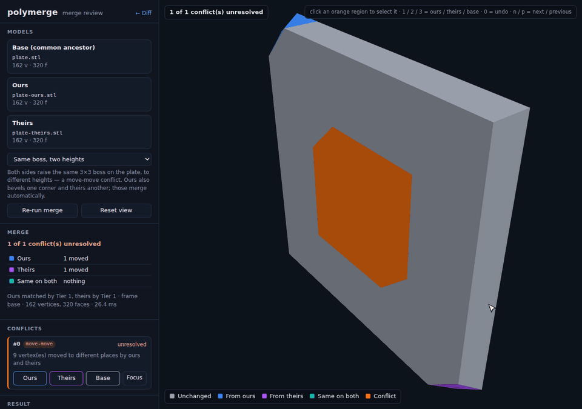
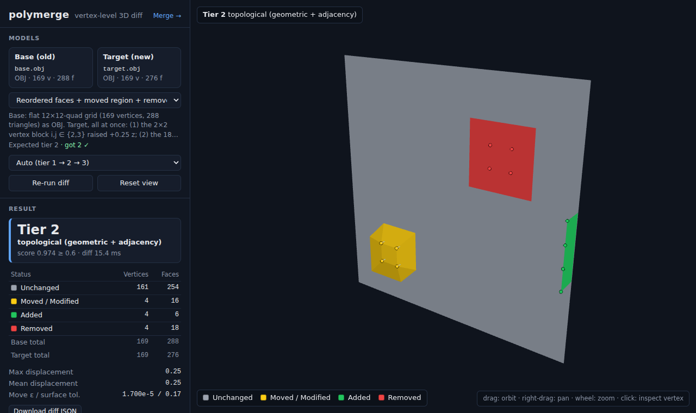
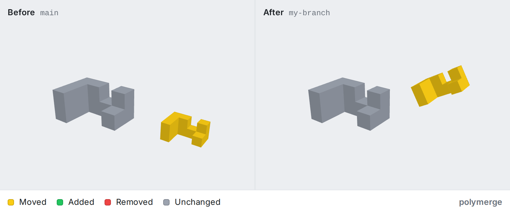

# polymerge

[](https://github.com/Joshua080/polymerge/actions/workflows/ci.yml)
[](https://www.npmjs.com/package/@joshuahurley/polymerge)

**Diff and three-way merge for 3D models (STL, OBJ, glTF/GLB), with a visual review in the browser and drivers for git. CAD files in STEP can be diffed and viewed too.**

> **Try it in your browser, no install:** open the [polymerge viewer](https://joshua080.github.io/polymerge/) and drop two versions of a model on it, or [open an example diff](https://joshua080.github.io/polymerge/?base=https://raw.githubusercontent.com/Joshua080/polymerge/v0.2.0/examples/plate/base.stl&target=https://raw.githubusercontent.com/Joshua080/polymerge/v0.2.0/examples/plate/ours.stl). It runs in your browser; your files are not uploaded.

Most 3D "diff" tools paint a heatmap of how far two surfaces are apart. polymerge works out which vertex in the old model *became* which vertex in the new one, even when the file was re-exported, re-ordered, converted from inches to millimetres, or had a part moved. On top of that correspondence it can:
- tell you exactly what changed;
- merge two people's edits to the same model the way git merges text: independent changes are combined, and real conflicts are shown to you to decide;
- comment on pull requests with a before/after render of every changed model ([GitHub Action](#use-it-in-pull-requests)).



*Merge review (`polymerge view base.stl ours.stl theirs.stl`).*
- Automatic edits from each side are blue and purple; the conflict is orange.
- Clicking the conflict shows both versions in place, and hovering a button previews that version.
- One click resolves it.



*Diff viewer (`polymerge view old.obj new.obj`).*
- One edit moved a patch (yellow), deleted another (red) and added a strip (green).
- The file's face order was also shuffled.
- The panel shows how the correspondence was found and the counts.

## Install

polymerge needs **Node.js 20 or newer**.

```bash
npm install -g @joshuahurley/polymerge
polymerge demo            # opens the merge review on a built-in example — no files needed
```

The package is `@joshuahurley/polymerge`; the command it installs is `polymerge`. To run it without installing: `npx @joshuahurley/polymerge demo`. To run it from a clone instead, see [Development](#development).

`polymerge view`, `review` and `demo` start a small local web server (bound to 127.0.0.1) and open your browser. The viewer is bundled in the package. It uses WebGL and runs entirely on your machine; nothing is uploaded.

## Using it

The examples below are real runs. The files are in this repository: `fixtures/cases/` holds the diff pairs, `examples/plate/` holds a three-way merge example, and `examples/step-plate/` holds the same kind of plate as STEP files.

### Diff two models

```console
$ polymerge diff fixtures/cases/mixed-topology-edit/base.obj fixtures/cases/mixed-topology-edit/target.obj --top 3
polymerge diff
  base   base.obj  OBJ  169 vertices · 288 faces
  target target.obj  OBJ  169 vertices · 276 faces

Correspondence: Tier 2 · topological (geometric + adjacency)
  ✗ Tier 1  score 0.007 < 0.950  index mode: 0.7% of the smaller mesh's faces preserved (2/276), …
  ✓ Tier 2  score 0.974 ≥ 0.600  161 seed(s) within moveEpsilon, 4 propagated, … edge consistency 99.8%

Vertices  unchanged 161  moved 4  added 4  removed 4
Faces     unchanged 254  modified 16  added 6  removed 18
Displacement  max 0.2500  mean 0.2500

Largest vertex moves (3 of 4):
  base #29 → target #77  Δ (0, 0, 0.2500)  |Δ| 0.2500
  base #28 → target #78  Δ (0, 0, 0.2500)  |Δ| 0.2500
  base #41 → target #83  Δ (0, 0, 0.2500)  |Δ| 0.2500
```

A model re-exported in other units reads as one unit conversion, not as every vertex moving. Here the part was also rotated and its file re-ordered:

```console
$ polymerge diff fixtures/cases/units-inch-to-mm/base.stl fixtures/cases/units-inch-to-mm/target.obj
…
Correspondence: Tier 3 · point cloud (ICP + nearest surface)
Vertices  unchanged 46  moved 0  added 0  removed 0
Faces     unchanged 88  modified 0  added 0  removed 0
Alignment  units in → mm (×25.4), rotation 90.00° about (0.000, 0.000, 1.000), translation (10.0000, 20.0000, 1.511e-7), rms 9.445e-7
```

A part moved on its own reads as a *moved part*, not as removed + added:

```console
$ polymerge diff fixtures/cases/moved-part/base.obj fixtures/cases/moved-part/target.obj
…
Vertices  unchanged 46  moved 46  added 0  removed 0
Moved parts (1):
  • "base": rotation 30.00°, centroid shift (-2.073e-8, 2.5000, 0.5000) [re-matched (was removed + added)]
```

Useful options:
- `--json out.json` (or `--json -`) writes the full result: every vertex correspondence and status;
- `--exit-code` exits 1 when the models differ, like `git diff --exit-code`;
- `-q` prints no report.

### Look at a diff in 3D

```bash
polymerge view old.stl new.obj
```

Colours:
- green: added;
- red: removed;
- yellow: moved or modified;
- grey: unchanged.

Click any vertex to read its correspondence, e.g. *base #29 → target #77, Δ (0, 0, 0.25)*. The two files can be different formats.

Two menus under the models change how they are shown:
- **Colours → Colour-blind safe** swaps red and green, which red-green colour blindness can't tell apart, for orange and blue: blue added, orange removed, yellow moved. Your browser remembers the choice. On the command line: `--palette colorblind`.
- **Up axis → Z up** is for CAD and 3D-printing files, which are usually Z up and otherwise open lying on their side. STEP files open Z up on their own. On the command line: `--up z`.

### Three-way merge

Give it the common ancestor (base) and the two edited versions (ours, theirs):

```console
$ polymerge merge examples/plate/base.stl examples/plate/ours.stl examples/plate/theirs.stl -o merged.stl
polymerge merge
  base    base.stl
  ours    ours.stl  (Tier 1)
  theirs  theirs.stl  (Tier 1)
Frame      base frame
Applied    ours: 1 moved vertex(es), 0 deletion(s), 0 new face(s)
           theirs: 1 moved vertex(es), 0 deletion(s), 0 new face(s)
           identical on both: 0 change(s)
Conflicts (1):
  #0 [move-move] 9 vertex(es) moved to different places by ours and theirs
      9 base vertex(es) near (4.000, 4.000, 1.000)  unresolved (base kept)
Result: 1 unresolved conflict(s) — those regions keep the BASE geometry. Resolve with --resolve ours|theirs or --pick <id>=ours|theirs.
Wrote merged.stl
$ echo $?
1
```

Both sides raised the same boss to different heights, which is a conflict. Each side's other edit (a bevelled corner) was applied automatically.

A conflict region keeps the **base** geometry until you choose; polymerge never guesses. Choose per region, or for all of them:

```console
$ polymerge merge examples/plate/base.stl examples/plate/ours.stl examples/plate/theirs.stl -o merged.stl --pick 0=theirs
…
  #0 [move-move] 9 vertex(es) moved to different places by ours and theirs
      9 base vertex(es) near (4.000, 4.000, 1.000)  → theirs
Result: clean — 162 vertices · 320 faces
Wrote merged.stl
```

`--resolve ours|theirs|base` resolves every conflict at once. `--report conflicts.json` writes the conflicts and statistics as JSON.

`-o merged.glb` (or `.gltf`) writes glTF that keeps the base file's node hierarchy, node names, transforms and meshes; a node that one side moved by its transform keeps that transform.

**What conflicts.** The rules are in [docs/merge-design.md](docs/merge-design.md). In short:
- the same vertex moved differently on the two sides;
- a vertex deleted on one side while the other side edited it or built on it;
- different geometry added on the same edge or in the same space;
- the same part moved differently;
- different whole-model transforms;
- a **collision**: two edits that are each fine but pass surfaces through each other, or fold faces over, when combined;
- for glTF/GLB, the same **material property**, face material or UV island changed differently, or two islands moved onto the same texels of a shared image ([appearance rules](docs/appearance-merge-design.md)).

**What does not conflict.** Edits to different vertices compose, even adjacent ones. So do the same change made on both sides, and a unit re-export on one side with local edits on the other: you get the edits, in the new units. For glTF, different properties of one material compose (a metallic material with a darker colour), and so do neighbouring repaints: ours paints the door red, theirs paints its handle chrome, and you get both.

### Review a merge in the browser

```bash
polymerge view examples/plate/base.stl examples/plate/ours.stl examples/plate/theirs.stl
```

This is the review in the GIF at the top. The merged model is coloured by who shaped each face:
- blue: from ours;
- purple: from theirs;
- teal: the same change on both sides;
- grey: untouched;
- **orange: unresolved conflict**.

To resolve:
1. Click an orange region in 3D, or its card. Hover **Ours / Theirs / Base** to preview that version in place.
2. Click a button, or press `1` / `2` / `3`, to choose. `0` undoes the choice, and `n` / `p` step between conflicts.
3. Finish:
   - Opened with `polymerge review <path>` during a conflicted `git merge`? Click **Save to repository**. It writes the resolved model to `<path>` and stages it (`git add`); then run `git commit`. Save is enabled once every conflict has a choice.
   - Or download the result, or copy the equivalent `polymerge merge … --pick …` / `polymerge resolve <path> --pick …` command.

A warning appears if your choices combine into a collision. Saving a result with a collision warning needs one more confirmation.

Saving is locked down (details in [docs/write-back-security.md](docs/write-back-security.md)):
- It works only for the file you named, only from the tab `polymerge review` opened (its URL carries a one-time token), and only while the server listens on 127.0.0.1.
- The browser sends only your choices. polymerge recomputes the file from git's conflict stages, exactly as `polymerge resolve` would.
- It refuses to overwrite the file if it changed since the review started.
- On a shared machine, use `--no-open` and paste the URL yourself: the token is visible in process listings while the browser launcher runs.

`polymerge demo` opens built-in examples in the review. The merge examples are `boss-height`, `thin-wall`, `parts`, `mixed-choices` and `clean`, e.g. `polymerge demo thin-wall`. Diff examples open the same way: `polymerge demo moved-part`.

### Use it with git

```bash
polymerge init            # this repository: writes .gitattributes and registers the git drivers
polymerge init --global   # or: every repository on this computer
```

`init` adds only what is missing, and keeps any line or setting you already have (it tells you which). Commit `.gitattributes`, so everyone who clones the repository gets it. Each person runs `polymerge init` once for the drivers. `--dry-run` shows what it would change. git runs `polymerge` by name, so install it globally (`npm install -g @joshuahurley/polymerge`).

What it writes (`polymerge git-setup` prints the same, to copy by hand):

```bash
# .gitattributes
*.stl  diff=polymerge merge=polymerge
*.obj  diff=polymerge merge=polymerge
*.gltf diff=polymerge merge=polymerge
*.glb  diff=polymerge merge=polymerge
*.step diff=polymerge merge=binary      # STEP: diff only (see "STEP files" below)
*.stp  diff=polymerge merge=binary

git config diff.polymerge.command "polymerge git-diff"
git config difftool.polymerge.cmd 'polymerge view "$LOCAL" "$REMOTE" --name "$MERGED"'
git config merge.polymerge.name "polymerge three-way 3D merge"
git config merge.polymerge.driver "polymerge git-merge %O %A %B %P"
```

Then:

```bash
git diff -- part.stl                              # structural report instead of "Binary files differ"
git log -p --ext-diff -- part.stl                 # history
git difftool -y -t polymerge HEAD~1 -- part.stl   # visual diff in the browser
git merge feature                                 # models merged three-way; a real conflict marks the file as conflicted
polymerge review part.stl                         # see the conflicts in the browser, pick by clicking, "Save to repository"
git commit                                        # after saving; or: polymerge resolve part.stl --pick 0=theirs && git add part.stl
```

### Use it in pull requests

A GitHub Action comments on pull requests that change STL, OBJ, glTF, GLB or STEP files. For each changed model it shows a before/after image from the same camera, coloured by what changed, plus a short structural summary. There is one comment per pull request, updated on every push.



```yaml
# .github/workflows/model-diff.yml (pull requests from branches of this repository)
name: Model diff
on: pull_request
permissions:
  contents: write        # commit the images to the polymerge-images branch
  pull-requests: write   # create / update the comment
jobs:
  diff:
    runs-on: ubuntu-latest
    steps:
      - uses: actions/checkout@v5
        with:
          fetch-depth: 0
      - uses: Joshua080/polymerge@v1
```

For pull requests from forks, use the two-workflow setup in [docs/github-action.md](docs/github-action.md), which also covers image hosting, Git LFS, security, and inputs such as `up-axis: z` (CAD and 3D-printing models) and `palette: colorblind`. `@v1` is a floating tag that always points at the latest release; pin a full commit SHA instead if you want it frozen.

### Open a diff by link

The viewer is also hosted as a static page, so someone can look at a diff **without installing anything**:

```
https://joshua080.github.io/polymerge/?base=<address of the old model>&target=<address of the new one>
https://joshua080.github.io/polymerge/?mode=merge&base=<…>&ours=<…>&theirs=<…>
```

For example, the plate example from this repository, as of release 0.2.0:

```
https://joshua080.github.io/polymerge/?base=https://raw.githubusercontent.com/Joshua080/polymerge/v0.2.0/examples/plate/base.stl&target=https://raw.githubusercontent.com/Joshua080/polymerge/v0.2.0/examples/plate/ours.stl
```

- The models can be on **any site**, as long as it is https, public, and allows other sites to read its files (CORS). `raw.githubusercontent.com` and `gist.githubusercontent.com` do. Pin a commit or tag in the address, so the link keeps showing the same diff.
- Everything runs in the visitor's browser. Nothing is uploaded, and nobody runs a server for it. The panel's "Loaded from" row shows which site each model came from.
- A host that doesn't allow cross-origin reads gives an error that says so. Private files can't be opened this way; use `polymerge view` locally for those.

### STEP files (CAD)

STEP (`.step`, `.stp`) is what most CAD tools export. polymerge can **diff and view** STEP files: `diff`, `view`, `info`, the git diff driver, the pull-request Action and the hosted viewer all take them. It does not merge them (see below).

STEP stores exact surfaces, not triangles, so it has to be tessellated first. That needs OpenCascade, a CAD kernel, from the [`occt-import-js`](https://github.com/kovacsv/occt-import-js) package (about 8 MB). It is an **optional download** that polymerge does not install by itself:

```bash
npm install -g occt-import-js@0.0.23        # next to a global polymerge
npx -p @joshuahurley/polymerge -p occt-import-js@0.0.23 polymerge diff old.step new.step   # or without installing
```

Without it, polymerge says exactly that and stops. A plate whose right-hand hole moved 5 mm:

```console
$ polymerge diff examples/step-plate/base.step examples/step-plate/ours.step --top 2
polymerge diff
  base   base.step  STEP  188 vertices · 380 faces
  target ours.step  STEP  188 vertices · 380 faces
  STEP   tessellated by OpenCascade (deflection 0.05 mm for both); a flat face re-triangulated around an edit counts as modified

Correspondence: Tier 2 · topological (geometric + adjacency)
…
Vertices  unchanged 130  moved 50  added 8  removed 8
Faces     unchanged 234  modified 100  added 46  removed 46
Displacement  max 5.0000  mean 4.2364

Largest vertex moves (2 of 50):
  base #51 → target #24  Δ (5.0000, 0, 0)  |Δ| 5.0000
  base #72 → target #43  Δ (5.0000, 0, 0)  |Δ| 5.0000
```

How to read it:
- **Both versions are tessellated with the same tolerance**, the largest gap allowed between a triangle and the true surface. It comes from the old version's size (1/2000 of its diagonal, rounded down to 1, 2 or 5 × 10ⁿ mm); otherwise surfaces that didn't change would get different triangles. STEP is always read in millimetres, whatever unit the file uses.
- **The hole's edge moved exactly 5 mm**, which is the real edit.
- **The counts also include re-triangulation.** OpenCascade re-triangulates a whole flat face when a hole in it moves, so the top and bottom faces read as modified, added and removed, although their shape didn't change. Reading changes per CAD face instead is possible future work; it is not built.
- Each solid becomes a part named as in the file (a part used twice gets "#2"), and colours become materials.

The hosted viewer reads STEP too. It **asks first**, then downloads OpenCascade from jsDelivr. The version is pinned and checked against its SHA-256 before it runs, and nothing is uploaded. `polymerge view` serves your own installed copy instead, so nothing is fetched from elsewhere.

**Merging STEP is refused** (`merge`, `review`, `resolve`, the git merge driver). polymerge merges triangles, so the result could only be a mesh, never STEP again, and re-triangulation would invent conflicts that CAD wouldn't have. Merge the change in your CAD tool. `git-setup` marks STEP as `merge=binary`, so git keeps your side and marks the file as conflicted instead of merging it line by line.

**Licence.** OpenCascade and `occt-import-js` are LGPL-2.1. polymerge (MIT) doesn't bundle or modify them. You install them yourself, or the hosted viewer downloads them when you agree. They stay a separate module you can replace: `POLYMERGE_OCCT=/path/to/occt-import-js` points the CLI at another build.

### Use it as a library

The engine is a separate package, `polymerge-core`. It runs in Node and in the browser.

```js
import { readFile, writeFile } from 'node:fs/promises';
import { loadMesh, diffMeshes, mergeMeshes, resolveMerge, writeStl } from 'polymerge-core';

const load = async (file) => loadMesh(await readFile(file), { fileName: file });
const [base, ours, theirs] = await Promise.all(['base.stl', 'ours.stl', 'theirs.stl'].map(load));

const diff = diffMeshes(base, ours);
console.log(diff.tierName, diff.stats.vertices); // Tier 1 · index/ID (direct lineage) { unchanged: 152, moved: 10, … }

const merge = mergeMeshes(base, ours, theirs);
for (const c of merge.conflicts) console.log(`#${c.id} ${c.message}`);
const resolved = resolveMerge(merge, { 0: 'theirs' });
await writeFile('merged.stl', writeStl(resolved.merged));
```

The engine logs every decision to the console (`[polymerge] …`). Pass `logger: { info() {}, warn() {} }` in the options to silence it. The types are in [`packages/core/src/types.ts`](packages/core/src/types.ts).

## Command reference

```
polymerge diff <base> <target> [--json out.json|-] [--force-tier 1|2|3] [--exit-code] [--top N] [-q]
polymerge view <base> <target> [--up y|z] [--palette standard|colorblind] [--port N] [--no-open]
polymerge view <base> <ours> <theirs>            merge review: see conflicts, resolve by clicking
polymerge merge <base> <ours> <theirs> [-o out.stl|obj|glb|gltf] [--resolve ours|theirs|base] [--pick id=side]
                [--report x.json] [--no-collision-check]
polymerge review <path>                          merge review of a conflicted git merge; saves and stages <path>
polymerge resolve <path> --pick <id>=<side>      finish a conflicted git merge of a model
polymerge demo [example]                         the viewer on a built-in example
polymerge info <file>                            the normalised mesh summary
polymerge init [--global] [--dry-run]            set git up: .gitattributes and the drivers
polymerge git-diff | git-merge | git-setup       git drivers, and the config to use them
```

STEP files work with `diff`, `view`, `info` and `git-diff`, given the optional reader ([STEP files](#step-files-cad)).

`polymerge --help` lists every option.

## How it works

1. **Normalise.** STL, OBJ and glTF/GLB are loaded with the three.js loaders, and STEP is tessellated by OpenCascade. All of them are converted into one mesh form:
   - vertices are welded;
   - glTF node transforms are baked in, and the scene (nodes, transforms, meshes) is recorded alongside, so glTF output can rebuild it.

   The same geometry therefore gives the same mesh in any format.
2. **Correspond, in tiers.** The first tier that clears its quality threshold wins, and every attempt is logged.

   | Tier | Strategy | Handles |
   |---|---|---|
   | 1 | Vertex order or embedded IDs, validated by face agreement | Direct edits: moved vertices, appended or trimmed geometry |
   | 2 | Geometric seeds + propagation along the mesh (inspired by MeshGit) | Re-ordered files, local topology edits, holes, new patches |
   | 3 | ICP alignment (rigid or uniform scale) + nearest-surface mapping | Whole-model moves and rotations, unit mismatch, re-meshing |

   After that, parts that moved rigidly on their own are re-registered, so they read as *moved*. A whole-model motion is reported once, e.g. as a unit conversion, instead of every vertex moving.
3. **Classify.** Every vertex becomes unchanged, moved, added or removed, and every face unchanged, modified, added or removed.
4. **Merge.** Each side is diffed against the base and split into frames (whole-model and per-part transforms) and local edits. Frames and edits are merged separately, then the result is checked for combined damage (collisions). Details and rationale: [docs/merge-design.md](docs/merge-design.md).

## What v1 does and doesn't handle

**Handles**
- **Formats.**
  - Input: STL (ASCII and binary), OBJ, GLB, and `.gltf` with embedded buffers. STEP for diff and view, with the optional OpenCascade reader.
  - Output for merges: STL, OBJ (keeps groups), GLB and self-contained `.gltf` (keep the base's nodes, names, transforms and meshes; positions round-trip bit for bit).
- **Diff.**
  - Direct vertex edits, re-ordered files, and local topology edits (holes, new patches, re-triangulated areas).
  - Whole-model moves, rotations and unit conversions (mm, cm, m, in, ft).
  - Re-meshed models, via surface mapping.
  - Parts moved on their own.
- **Merge.**
  - Independent edits are combined, including frame composition (a unit re-export on one side plus edits on the other).
  - Conflicts are detected per region and resolved per region.
  - Collisions are detected: combined edits that make surfaces cross or fold.
  - **Materials, face materials, UVs and texture references of glTF/GLB files** are merged too: material properties one by one, face materials face by face, UVs as whole islands, and textures by their bytes. The merged appearance is written into the GLB / `.gltf` output.
  - git diff and merge drivers, including for glTF/GLB.
- **Scale.** Tested up to about 100k vertices:
  - a diff takes about 0.3 s (Tier 1) to 2.5 s (Tier 3);
  - a 100k-vertex merge takes about 1.2 s, of which the collision check is about 25%.

**Doesn't handle (yet), by design or by scope.** These are deliberate limits, not surprises.
- **The collision check detects damage, not design judgement** (design doc §4.1). It does not flag:
  - surfaces that only touch or overlap in the same plane;
  - near misses: clearances, minimum wall thickness, tolerances;
  - anything else that needs design intent.

  A merge can be free of collisions and still be wrong for your part. Review it.
- **STEP is diffed as triangles, and never merged** ([STEP files](#step-files-cad)). A flat face re-triangulated around an edit reads as modified. Parameter changes (a hole Ø8 → Ø8.1) read as moved vertices. IGES, STEP-XML and compressed `.stpZ` are not read.
- **Re-meshed sides can't be merged vertex by vertex.** If one side re-tessellated the model, the merge reports a whole-model `lineage` conflict: you pick one side's whole mesh. Transferring edits between tessellations is future work.
- **A side that splits a part and moves half of it** is seen as local moves, not a part motion. The other side's edits on that half then conflict.
- **Appearance merges for glTF/GLB only** ([rules](docs/appearance-merge-design.md)). STL and OBJ have no materials or UVs to merge (OBJ `vt` / `.mtl` and STL colours are not merged). Limits:
  - texel content is never merged or judged: two different images in one slot conflict, and a UV edit on one side with an image edit on the other is merged unjudged;
  - texture-space overlap is flagged only for islands on the same image that overlap in raw UV coordinates (not through wrapping or `KHR_texture_transform`);
  - a repaint or re-UV on faces the other side remeshed is a conflict, not transferred;
  - vertex colours, normals and tangents, and `KHR_materials_variants` are not merged.
- **The merge review in the viewer** lists appearance conflicts as cards and resolves them, but does not yet highlight them or show textures: it shows geometry only.
- **glTF output keeps geometry, structure and appearance, but not everything else.**
  - Normals and tangents are not written (viewers compute flat normals; a normal-mapped material makes validators warn that its tangent space is generated).
  - Skinned, morphed and GPU-instanced meshes are written as static geometry in their posed shape.
  - Animations, cameras, lights, `extras` and most extensions are dropped.
  - Node renames or re-parenting in a branch are not merged; the base's names and hierarchy win.
- **Not supported on input:**
  - `.gltf` files with external `.bin`/image files;
  - Draco- or meshopt-compressed glTF;
  - glTF scenes other than the default one;
  - OBJ objects that contain line (`l`) elements (they are skipped with a warning).
- **Ambiguous geometry:**
  - A part deleted in one place with an *identical* copy added elsewhere reads as a move.
  - Symmetric shapes aligned by Tier 3 report the least-motion equivalent.
  - A regular lattice shifted by exactly one period can be mis-matched.
  - A region dragged far from its connected neighbours is followed only within about 3 edge lengths.
- **Viewer:**
  - Y is up unless the model is STEP; a Z-up STL or OBJ (most CAD and 3D-printing exports) needs **Up axis → Z up**, or `--up z`. The viewer doesn't guess it from the shape.
  - Saving into the repository works only from `polymerge review` (a conflicted `git merge`), for that one file, and only while the server listens on 127.0.0.1. `view` with three files and `demo` stay read-only: download the result or use `polymerge merge -o`.
  - The viewer's server answers only requests addressed to `localhost` or an IP address. Reaching it through another host name (a reverse proxy, `myhost.local`) is refused.

The full list of known limits and next steps is kept in [DEVLOG.md](DEVLOG.md).

## Development

```bash
git clone https://github.com/Joshua080/polymerge.git && cd polymerge
npm install
npm run build          # core → CLI → web viewer
npm link -w @joshuahurley/polymerge   # optional: puts this checkout's `polymerge` on your PATH
npm test               # unit, fixture and merge tests, then the perf tests on their own
npm run e2e            # headless-browser viewer, CLI → browser, worker, merge review, real git, STEP, packed npm install
npm run verify         # everything CI runs
npm run dev            # viewer dev server with the built-in examples
```

```
packages/core   polymerge-core — parsers, tiered diff engine, three-way merge, writers (Node + browser)
packages/cli    @joshuahurley/polymerge — the polymerge command, with the web viewer bundled at publish time
apps/web        the Vite + three.js viewer
action/         the pull-request GitHub Action (action.yml at the root runs it)
fixtures/       known-answer model pairs and their generator
examples/       the three-way merge example and the STEP plate used in this README
docs/           design notes (merge semantics, appearance merge, write-back security, the GitHub Action) and README images
scripts/        end-to-end checks (CLI → browser, merge review, git, STEP, packed install, the Action), image capture, the STEP example generator
```

CI runs `npm run verify` on every push. One of its checks, `scripts/e2e-pack.mjs`, packs both npm packages, installs them into an empty project and uses them from there: the CLI, the library example above, and the bundled viewer in a real browser.

### Releasing

Two steps, both on GitHub:
1. **Actions → Prepare release → Run workflow**, with the new version (for example `0.3.0`). It opens a pull request that sets every package to that version and moves [CHANGELOG.md](CHANGELOG.md)'s "Unreleased" notes under it.
2. **Merge that pull request.** `.github/workflows/release.yml` then:
   - runs the full `npm run verify`, and stops there if anything fails;
   - publishes `polymerge-core`, then `@joshuahurley/polymerge`, with npm provenance;
   - tags the merge `v0.3.0` and writes its GitHub Release from the changelog;
   - moves the Action's `v1` tag to it.

It needs the repository secret `NPM_TOKEN`, and (for step 1) **Settings → Actions → General → Allow GitHub Actions to create and approve pull requests**. Every step skips what already exists, so a run that failed halfway can be re-run as is. `node scripts/release.mjs prepare 0.3.0` does step 1 locally, and pushing a version tag by hand still works.

The README images are regenerated with `node scripts/readme-images.mjs`.

## Contributing

Bug reports (especially models polymerge gets wrong), ideas and pull requests are welcome:
- [CONTRIBUTING.md](CONTRIBUTING.md): setting up, testing and making a change.
- [CODE_OF_CONDUCT.md](CODE_OF_CONDUCT.md).
- [SECURITY.md](SECURITY.md): report security problems privately.
- [CHANGELOG.md](CHANGELOG.md): what changed in each release.

## License

[MIT](LICENSE) © Joshua Hurley
